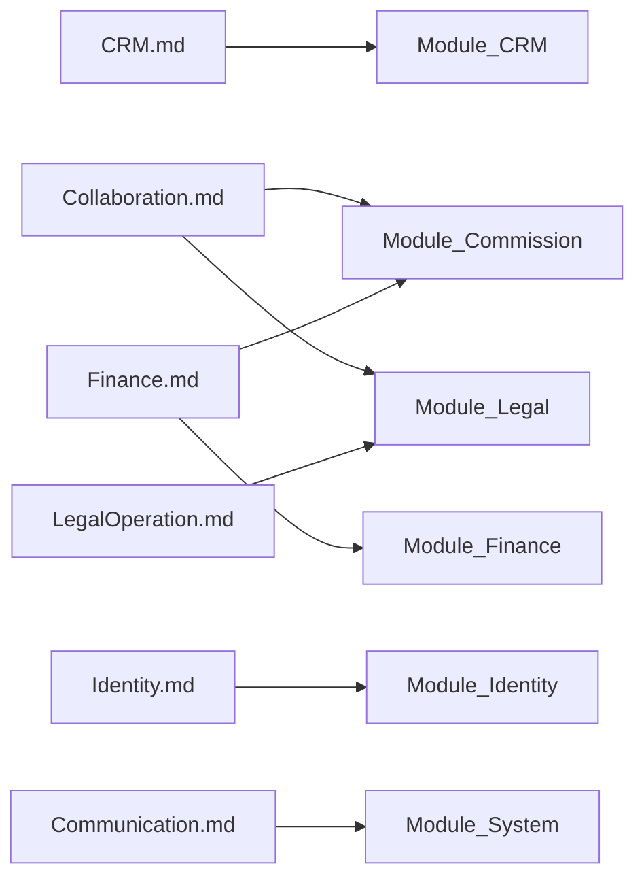

# Phase 02 — Domain Documentation Index

> Vietnamese version: [README.vi.md](./README.vi.md)  
> **Canonical:** English. Sync EN/VI in the same change set.

## 1. Purpose

This folder is the **business-domain source of truth** for DYN CRM after Phase 00 (product) and Phase 01 (architecture) are locked. It defines *what the business does* so Phase 03 (Database) and Phase 04 (Development) can proceed without redesign.

## 2. Scope

| In scope | Out of scope |
|----------|--------------|
| Business capabilities and lifecycles | NestJS / Prisma / SQL / REST / DTO / UI |
| Actors, permissions (business level), events | Exact API routes and table DDL |
| Cross-domain interactions | Coding conventions |

**Rule:** Do not invent business rules. Missing items → Open Questions / TODO. Never contradict Phase 00 / Phase 01; if a Phase 02 proposal conflicts, mark it explicitly until stakeholders re-lock Scope.

## 3. Background

DYN CRM is a **Legal Operations Platform with CRM capability** for a law firm currently running mostly on Excel. MVP: ~30 concurrent users, pragmatic configurable workflows (not BPMN), modular monolith (Phase 01).

## 4. Document map

| Document | Business capability |
|----------|---------------------|
| [BusinessCapabilityMap.md](./BusinessCapabilityMap.md) | Cross-capability map and end-to-end value chain |
| [CRM.md](./CRM.md) | Lead, Customer, Contact, import, follow-up, timeline |
| [Collaboration.md](./Collaboration.md) | CTV / collaborator partnership and contract request |
| [LegalOperation.md](./LegalOperation.md) | Contract, configurable workflow/Kanban, tasks, documents |
| [Finance.md](./Finance.md) | Order, schedule, payment, debt, VAT invoice, commission |
| [Identity.md](./Identity.md) | User, role, permission, org extension points |
| [Communication.md](./Communication.md) | Notification, reminder, email (non-marketing) |

## 5. Alignment to Phase 01 modules

## 6. Reading order

1. BusinessCapabilityMap  
2. Identity (actors/permissions foundation)  
3. CRM → Collaboration → LegalOperation → Finance  
4. Communication (cross-cutting)

## 7. Consistency gates

| Locked source | Must respect |
|---------------|--------------|
| Phase 00 Scope / Glossary | Terms: Lead ≠ Customer; Contract ≠ Order; commission on **collected payment** |
| Phase 00 Scope (2026-08-03) | CTV restricted portal + assigned customers + Contract Request (Collaboration) |
| Phase 00 Scope (2026-08-03) | Finance chain: Payment **before** VAT Invoice |
| Phase 01 Module / Security | NestJS RBAC; CTV hard isolation; async commission via worker |

## 8. Standard sections (domain docs)

Each domain document (`CRM`, `Collaboration`, `LegalOperation`, `Finance`, `Identity`, `Communication`) follows sections **1–14** (capability narrative) and, after review, architectural reference sections:

| § | Section | Purpose |
|---|---------|---------|
| 15 | Aggregate Boundaries | Business ownership of roots / children (not tables) |
| 16 | Domain Invariants | Rules that must never be violated |
| 17 | Primary Business Use Cases | Concise UC catalog |
| 18 | Ownership Matrix | Which domain owns object lifecycle |
| 19 | Domain Event Matrix | Producer → consumers |
| 20 | Business Constraints | Business (not technical) constraints |
| 21 | Dynamic Features | Configurable capabilities (esp. Identity RBAC, Legal requirements) |
| 22 | Business Metrics | Foundation for Dashboard |
| 23 | Cross Domain Dependency | Depends on / Provides to |

`BusinessCapabilityMap` remains the cross-capability map (no duplicate per-domain aggregates).

## 9. TODO (phase-level)

- [ ] Stakeholder pass on Open Questions in each domain doc (schema-critical first)  
- [x] Re-lock Scope for Collaboration CTV expansion + Finance invoice-after-payment (2026-08-03)  
- [ ] Proceed to Phase 03 Database only after critical Open Questions affecting schema are closed  
