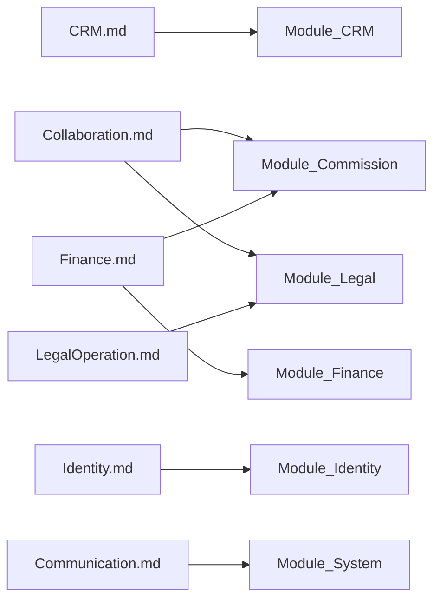

# Phase 02 — Mục lục Domain

> Bản tiếng Việt của [README.md](./README.md). Canonical: English.

## 1. Mục đích

Thư mục này là **nguồn chân lý domain nghiệp vụ** của DYN CRM sau khi Phase 00 và Phase 01 đã khóa. Định nghĩa *doanh nghiệp làm gì* để Phase 03 (Database) và Phase 04 (Development) không phải thiết kế lại.

## 2. Phạm vi

| Trong phạm vi | Ngoài phạm vi |
|---------------|---------------|
| Năng lực nghiệp vụ và vòng đời | NestJS / Prisma / SQL / REST / DTO / UI |
| Actor, permission (mức nghiệp vụ), event | Route API và DDL bảng Exact |
| Tương tác xuyên domain | Coding convention |

**Quy tắc:** Không bịa business rule. Thiếu → Open Questions / TODO. Không mâu thuẫn Phase 00 / 01; nếu đề xuất Phase 02 lệch Scope đã khóa → đánh dấu tường minh đến khi stakeholder khóa lại.

## 3. Bối cảnh

DYN CRM là **nền tảng Legal Operations kèm CRM** cho văn phòng luật đang chạy chủ yếu trên Excel. MVP: ~30 user đồng thời, workflow cấu hình pragmatic (không BPMN), modular monolith (Phase 01).

## 4. Bản đồ tài liệu

| Tài liệu | Năng lực nghiệp vụ |
|----------|-------------------|
| [BusinessCapabilityMap.vi.md](./BusinessCapabilityMap.vi.md) | Bản đồ capability và chuỗi giá trị E2E |
| [CRM.vi.md](./CRM.vi.md) | Lead, Customer, Contact, import, follow-up, timeline |
| [Collaboration.vi.md](./Collaboration.vi.md) | CTV / hợp tác và yêu cầu hợp đồng |
| [LegalOperation.vi.md](./LegalOperation.vi.md) | Hợp đồng, workflow/Kanban cấu hình, task, tài liệu |
| [Finance.vi.md](./Finance.vi.md) | Order, lịch thanh toán, payment, nợ, HĐ VAT, hoa hồng |
| [Identity.vi.md](./Identity.vi.md) | User, role, permission, điểm mở rộng tổ chức |
| [Communication.vi.md](./Communication.vi.md) | Notification, reminder, email (không marketing) |

## 5. Ánh xạ Phase 01 modules

## 6. Thứ tự đọc

1. BusinessCapabilityMap  
2. Identity  
3. CRM → Collaboration → LegalOperation → Finance  
4. Communication  

## 7. Cổng nhất quán

| Nguồn đã khóa | Phải tôn trọng |
|---------------|----------------|
| Phase 00 Scope / Glossary | Lead ≠ Customer; Contract ≠ Order; hoa hồng trên **tiền đã thu** |
| Phase 00 Scope (2026-08-03) | Portal CTV hạn chế + khách được gán + Contract Request (Collaboration) |
| Phase 00 Scope (2026-08-03) | Chuỗi Finance: Payment **trước** VAT Invoice |
| Phase 01 Module / Security | NestJS RBAC; cô lập CTV; commission async qua worker |

## 8. Mục chuẩn (tài liệu domain)

Mỗi tài liệu domain (`CRM`, `Collaboration`, `LegalOperation`, `Finance`, `Identity`, `Communication`) có mục **1–14** (diễn giải năng lực) và sau review có thêm mục tham chiếu kiến trúc:

| § | Mục | Mục đích |
|---|-----|----------|
| 15 | Aggregate Boundaries | Ranh giới sở hữu nghiệp vụ (không phải bảng DB) |
| 16 | Domain Invariants | Quy tắc không được vi phạm |
| 17 | Primary Business Use Cases | Catalog UC ngắn |
| 18 | Ownership Matrix | Domain nào sở hữu vòng đời đối tượng |
| 19 | Domain Event Matrix | Producer → consumers |
| 20 | Business Constraints | Ràng buộc nghiệp vụ (không phải kỹ thuật) |
| 21 | Dynamic Features | Năng lực cấu hình (Identity RBAC, Legal requirements) |
| 22 | Business Metrics | Nền cho Dashboard |
| 23 | Cross Domain Dependency | Phụ thuộc / Cung cấp cho |

`BusinessCapabilityMap` giữ vai trò bản đồ xuyên capability (không nhân đôi aggregate từng domain).

## 9. TODO (cấp phase)

- [ ] Stakeholder duyệt Open Questions từng domain (ưu tiên ảnh hưởng schema)  
- [x] Khóa lại Scope: mở rộng CTV Collaboration + Invoice sau Payment (2026-08-03)  
- [ ] Chỉ sang Phase 03 khi Open Questions ảnh hưởng schema đã đóng  
