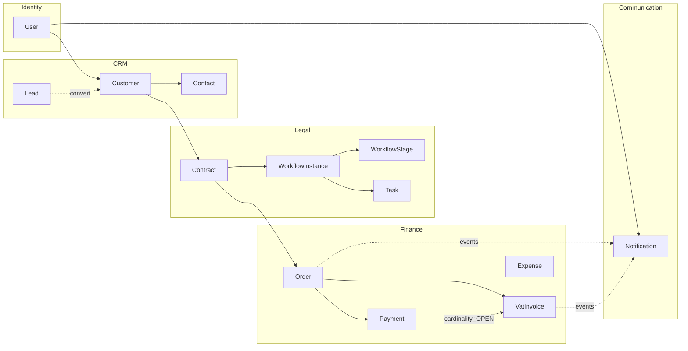
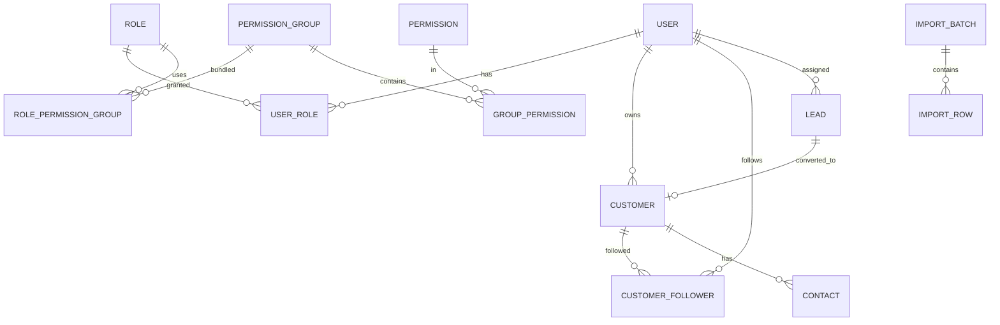
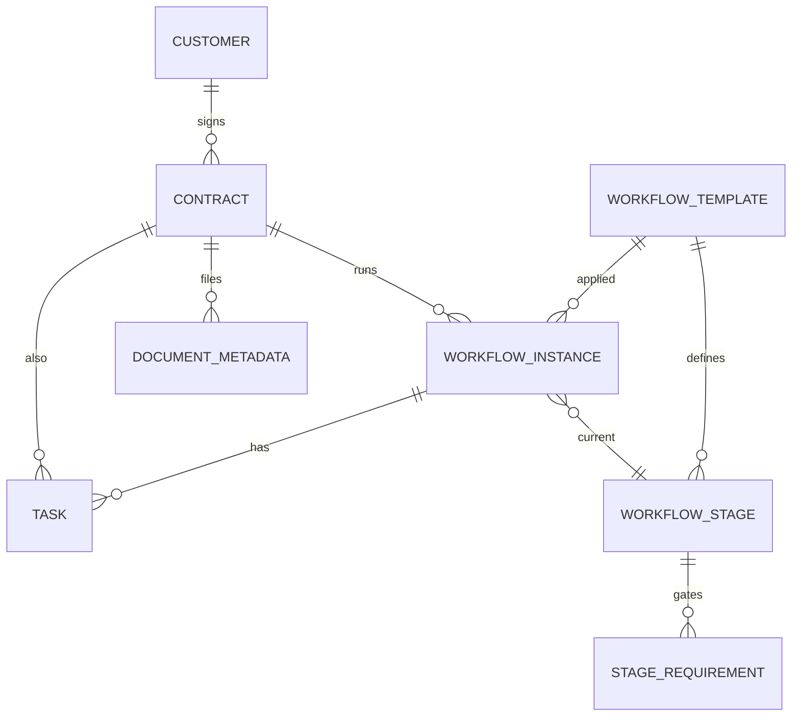
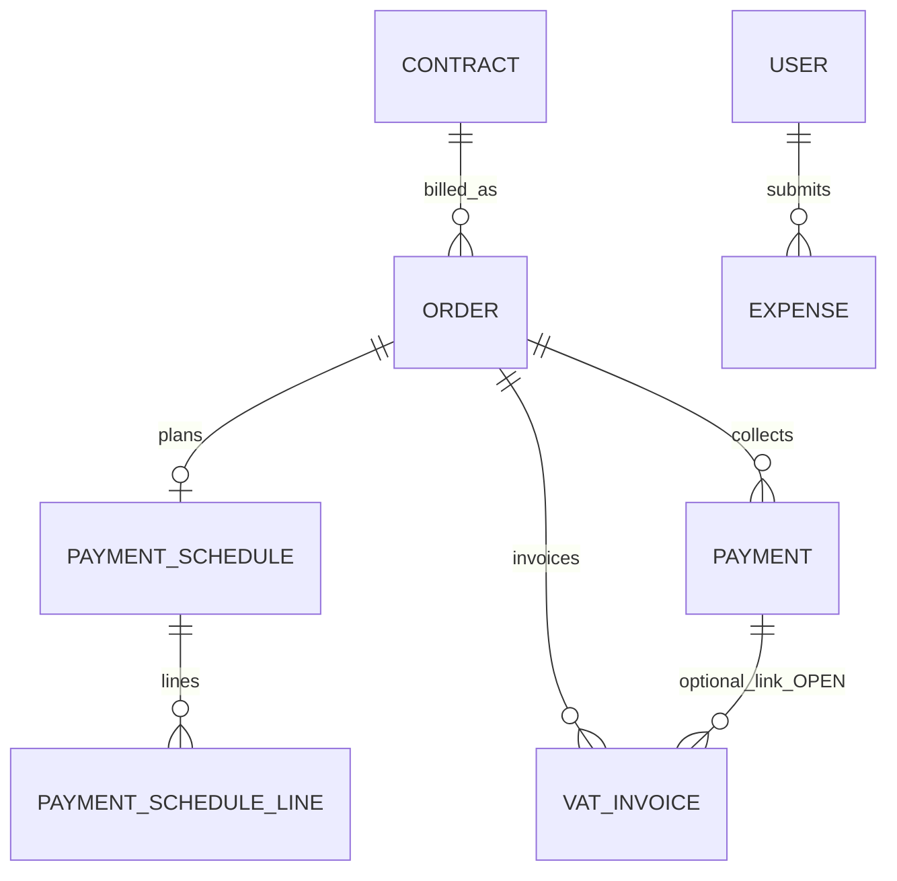
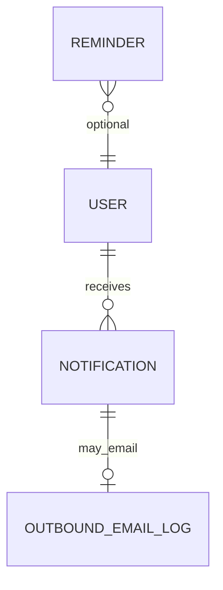

# Schema design contract — DYN CRM Phase 03

> Vietnamese version: [SchemaDesign.vi.md](./SchemaDesign.vi.md)  
> Principles: [ModelingPrinciples.md](./ModelingPrinciples.md) · Aggregates: [AggregateCatalog.md](./AggregateCatalog.md)

**This is not `schema.prisma`.** Logical/conceptual model for review, then translation to Prisma.

**IDs (assumption):** UUID primary keys. **Audit on mutating aggregates:** `createdAt`, `updatedAt`, `createdByUserId`, `updatedByUserId` (timestamptz UTC). **Money:** `NUMERIC(18,2)` VND, no float. **Soft delete:** `deletedAt` on Customer, Contract (and User if retained); unique contract number is **partial** among `deletedAt IS NULL`.

No Collaboration / CTV portal tables.

---

## 1. Identity

### 1.1 Auth subject → User

```text
Supabase Auth (sub)  --1:1 unique-->  User.authSubjectId
Other tables                         -->  User.id   (never Auth SDK types)
```

Disabled/deactivated User cannot act even if IdP session exists (enforced in application; status stored here).

### 1.2 Entities

| Entity | Key columns | Notes |
|--------|-------------|-------|
| **User** | id; authSubjectId **R UNIQUE**; email O; displayName R; status R; deletedAt O | status: documented lifecycle Invited/Active/Suspended/Deactivated — **enum candidate** (domain diagram, not stakeholder-open) |
| **Role** | id; code UNIQUE; name R | Seed Glossary roles **except** `COLLABORATOR` unless S6 reversed |
| **Permission** | id; code UNIQUE (`resource.action`); description O | Unknown code ⇒ deny in app; DB only stores known catalog |
| **PermissionGroup** | id; code UNIQUE; name R | **ASSUMPTION:** groups exist (Phase 02 recommended). Mandatory vs optional = **OPEN** |
| **UserRole** | userId, roleId | Unique (userId, roleId) |
| **RolePermissionGroup** | roleId, permissionGroupId | Unique pair |
| **GroupPermission** | permissionGroupId, permissionId | Unique pair |

Chi approver “Nhi”: **no dedicated table**. Represent as `expense.approve` permission assigned via Role/Group, and/or a named User — Identity OPEN, not a schema person-row.

Organization/Department: **no MVP tables**.

### 1.3 OPEN (Identity)

- PermissionGroup mandatory vs Role→Permission direct  
- `COLLABORATOR` seed  
- Chi approver mapping  

**Prisma:** Identity **GREEN to draft**; freeze Group vs direct before **final** Identity migration if you want zero follow-up migrate.

---

## 2. CRM

Lead ≠ Customer (two tables). Convert stores `Lead.convertedCustomerId` and terminal Lead status — application invariant: convert once.

### 2.1 Entities

| Entity | Key columns | Notes |
|--------|-------------|-------|
| **Lead** | id; source R; status R (string, **not** Prisma enum); ownerId O → User; convertedCustomerId O → Customer UNIQUE; name/phone/email/taxId O; notes via Note | Source list locked in domain (Facebook, Google, …) but stored as string so it can become config later. **No unique** on phone/email/name |
| **Customer** | id; type R **enum** Individual\|Company; ownerId R → User; industryOrField O (string); legalName / displayName R; phone/email/taxId O; deletedAt O | **No extra date column** (S11 OPEN). **No hasUsedService column** |
| **Contact** | id; customerId R → Customer; name R; roleTitle O; phone/email O | Lead-only Contact **OPEN** — draft requires Customer FK. If Lead contacts are locked later, add nullable leadId **or** a LeadContact table |
| **CustomerFollower** | customerId, userId | Unique pair; Followers ≠ Owner |
| **Note** | id; subjectType R (LEAD\|CUSTOMER); subjectId R; body R; authorUserId R | Polymorphic by convention (no FK to both). App validates subject exists |
| **Activity** | id; subjectType R; subjectId R; type R; payload O; actorUserId R; occurredAt R | CRM timeline. Legal has its own activity table |
| **ImportBatch** | id; fileRef O; status R; createdByUserId R; committedAt O | |
| **ImportRow** | id; batchId R; rowNumber R; rawJson R; validationStatus R; resultingLeadId O | Duplicate **flags** at row level; uniqueness not assumed |

### 2.2 Duplicate policy

**OPEN.** Therefore:

- No `UNIQUE(phone)`, `UNIQUE(email)`, `UNIQUE(name)`.  
- Index phone/email for **search** (non-unique).  
- Duplicate detection is application + ImportRow flags.

### 2.3 Export (used service / industry)

| Need | Model |
|------|--------|
| Industry / field | `Customer.industryOrField` VARCHAR **O** — catalog vs free text **OPEN**; no lookup table until locked |
| Used service | **Derive** at query time. Draft rule (ASSUMPTION, not LOCKED): customer has used service if **at least one Contract** exists. Alternative (OPEN): Contract Signed+, or Order, or collected Payment |

No reporting/warehouse tables.

### 2.4 OPEN (CRM)

Lead status enum; duplicate keys; convert map; Contact on Lead; industry catalog; extra date; used-service rule.

---

## 3. Legal

### 3.1 Contract vs Kanban (do not collapse)

| Concept | Draft representation | Status |
|---------|----------------------|--------|
| Contract lifecycle | `Contract.status` — Glossary closed set **today** → **enum candidate** | LOCKED labels; Cancelled **matrix** OPEN (no extra table) |
| Kanban columns | `WorkflowStage` **rows** (`name`, `sortOrder`, templateId) | CONFIRMED configurable; **not** Prisma enum |
| Are Kanban columns actually Contract statuses? | **OPEN** — schema keeps both so either answer survives | If yes later: add StatusCatalog and migrate `Contract.status` → FK |

### 3.2 Entities

| Entity | Key columns | Notes |
|--------|-------------|-------|
| **Contract** | id; contractNumber R; customerId R → Customer; status R; title O; signedAt O; deletedAt O | **UNIQUE (contractNumber) WHERE deletedAt IS NULL**. Allocation manual vs generated **OPEN** — both fit a required string |
| **WorkflowTemplate** | id; name R; isActive R | Admin-owned |
| **WorkflowStage** | id; templateId R; name R; sortOrder R; responsibleRoleCode O | Kanban column. Unique (templateId, sortOrder) recommended |
| **StageRequirement** | id; stageId R; type R (string catalog: FILE_UPLOAD, MANUAL_APPROVAL, PAYMENT_COMPLETED, …); configJson O | Types are data/catalog strings, not a frozen Prisma enum of all future types |
| **WorkflowInstance** | id; contractId R; templateId R; currentStageId R; startedAt R | Multi-instance per Contract **OPEN** — draft allows 1..N (no unique on contractId). If later “exactly one”, add unique |
| **Task** | id; instanceId O; contractId R; title R; assigneeUserId O; dueAt O; completedAt O; status R (string) | Reminder is Communication, not a Task column for N-month Order expiry |
| **DocumentMetadata** | id; contractId R; storageKey R; fileName R; uploadedByUserId R | Bytes via StoragePort (MinIO/Supabase) — not in PG |
| **LegalActivity** | id; contractId R; actorUserId R; type R; occurredAt R | Legal timeline |

Duplicate `contractNumber` insert/update → DB unique violation → application maps to business error. App check alone is **insufficient**.

### 3.3 OPEN (Legal)

Kanban = Stage vs Status; number generator; multi-instance; Completed vs Workflow (policy, not a table).

---

## 4. Finance

Locked chain: **Contract → Order → PaymentSchedule → Payment → (Debt view) → VatInvoice**. Invoice **after** Payment is a **use case** (do not issue invoice without a collected payment in application). Commission **not** in core tables.

### 4.1 Order

| Column | Draft | Notes |
|--------|-------|-------|
| id | R | |
| contractId | R → Contract | Order originates from Contract |
| serviceStart | O **date** | Validity owned by Order. **Requiredness OPEN** |
| serviceEnd | O **date** | Alert reads this + config N. **Requiredness OPEN** |
| status | O string | **OPEN set — not a Prisma enum.** Do **not** ship DRAFT/CONFIRMED/CLOSED/CANCELLED as an enum |
| totalNet, vatRate, totalGross | R NUMERIC | VAT 10% exclusive MVP; vatRate may copy from AppConfig |
| currency | R default VND | |

**Expiry N months:** **not** an Order column. `AppConfig` key e.g. `order.expiryAlertMonths`. Per-Order N is **OPEN** — do not add `expiryAlertMonths` on Order until locked.

Expired status / extend behavior: **not modeled** (OPEN).

### 4.2 Payment schedule & payment

| Entity | Key columns | Notes |
|--------|-------------|-------|
| **PaymentSchedule** | id; orderId R UNIQUE (1 schedule per Order — ASSUMPTION) | |
| **PaymentScheduleLine** | id; scheduleId R; dueDate O; amount R; sortOrder R | Installments |
| **Payment** | id; orderId R; scheduleLineId O; amount R; method R **enum** CASH \| BANK_TRANSFER \| QR; recordedAt R; verificationStatus R **string** (Recorded/Verified/Voided = working assumption, **not** locked enum); provider O; providerPaymentId O; providerStatus O | Partial allowed. **No SepayPayment table.** provider* are opaque PaymentProviderPort fields |
| Outstanding | derived | `Order.totalGross − SUM(Payment.amount)` excluding voided — until Debt table is locked |

Application invariant: payment amount ≤ outstanding (OPEN whether verified-only counts).

### 4.3 VAT Invoice

| Column | Draft | Notes |
|--------|-------|-------|
| id | R | |
| invoiceNumber | R | Uniqueness **not** stakeholder-locked (contract number is). Treat UNIQUE as **recommended**; confirm legal numbering **OPEN** |
| orderId | R → Order | |
| paymentId | **O** → Payment | **Cardinality OPEN** — see below |
| sourceType | R string | Contract \| Milestone \| Manual (Phase 00 sources) |
| netAmount, vatAmount, grossAmount | R | 10% exclusive |
| issuedAt | R | |
| dueAt | O | Needed for InvoiceDueSoon/Overdue — those events **OPEN**; column optional |

**Payment → Invoice cardinality (OPEN):**

| If locked as | Schema change |
|--------------|----------------|
| 1 Payment : 1 Invoice | `paymentId` R UNIQUE |
| N Payments : 1 Invoice | drop `paymentId`; add `PaymentInvoice` (paymentId, invoiceId) |
| 1 Payment : N Invoices | `paymentId` O, not unique |

Draft keeps **nullable `paymentId`** so none of the three is silently chosen. Application still enforces “invoice after at least one payment on the Order”.

Invoice **status** enum: **not** invented.

### 4.4 Debt

| Option | Draft |
|--------|--------|
| Derived | **Selected for draft (ASSUMPTION)** — no table |
| Stored | Add `Debt` later (orderId UNIQUE, remainingAmount) |
| Hybrid | Stored snapshot + derived audit |

**OPEN.** Do not pretend final.

### 4.5 Income / Expense — ASSUMPTION (Option A)

| UI tab | Source of truth |
|--------|-----------------|
| **Thu** | Payments (collected). Query/filter — **no Income entity** |
| **Chi** | `Expense` table (explicit). Approval required |

| Expense columns | Notes |
|-----------------|-------|
| id; amount R; currency R; incurredOn R; payeeName O; description O; ctvRelated R bool default false; status R string (submitted/approved — **not** locked enum); submittedByUserId R; approvedByUserId O; approvedAt O | CTV money = expense row + `ctvRelated` and/or payee note — **not** a CTV aggregate. Semantics Thu vs Chi vs note still **OPEN**; this table exists so Chi approval has a place to live |

**Not LOCKED.** If stakeholders choose note-only, `Expense` can be dropped. If they choose a unified ledger, replace Thu query + Expense with `FinancialTransaction` **without** copying Payment amounts into a second income line.

### 4.6 Commission

**Not in core schema.** Isolated: if re-locked, `Commission (id, paymentId, beneficiaryUserId, rate, amount)` plus worker. Must not block Identity/CRM/Legal.

### 4.7 OPEN (Finance) — blocks final Finance Prisma

Order status; start/end required; Debt; Payment↔Invoice; invoice due date; Expense vs note vs ledger; Commission; SePay persist beyond provider*; Chi approver identity.

---

## 5. Communication

| Entity | Key columns | Notes |
|--------|-------------|-------|
| **Notification** | id; recipientUserId R; type R; title R; body O; readAt O; sourceType O; sourceId O | Types include `ORDER_EXPIRING_SOON`, `INVOICE_ISSUED`. `INVOICE_DUE_SOON` / `INVOICE_OVERDUE` only if Finance due date + product lock |
| **Reminder** | id; sourceType R; sourceId R; fireAt R; sentAt O | **OPEN:** persist vs BullMQ-only. Draft **includes** table so either works |
| **OutboundEmailLog** | id; toAddress R; templateKey R; providerMessageId O; status R; relatedNotificationId O | MailPort result |
| **AppConfig** | key UNIQUE; valueJson R | `order.expiryAlertMonths` (N); not domain-owned by Finance |

Finance/Legal tables **do not** store notification delivery state.

---

## 6. Cross-domain relationships

```text
User 1──* Customer (owner)
User *──* Customer (followers)
Customer 1──* Contact
Customer 1──* Contract
Contract 1──* Order
Order 1──1 PaymentSchedule (assumption)
PaymentSchedule 1──* PaymentScheduleLine
Order 1──* Payment
Order 1──* VatInvoice
Payment 0..1──0..* VatInvoice   ← cardinality OPEN (nullable paymentId)
Contract 1──* WorkflowInstance
WorkflowTemplate 1──* WorkflowStage
WorkflowStage 1──* StageRequirement
WorkflowInstance *──1 WorkflowStage (current)
WorkflowInstance 1──* Task
Contract 1──* DocumentMetadata
User 1──* Notification
```

| Edge | FK owner | Card. | Optional? | Boundary |
|------|----------|-------|-----------|----------|
| Customer.ownerId | CRM | 1 | No | Identity User |
| CustomerFollower | CRM | 0..* | Yes | Identity User |
| Contact.customerId | CRM | *→1 | No | CRM |
| Contract.customerId | Legal | *→1 | No | CRM Customer |
| Order.contractId | Finance | *→1 | No | Legal Contract |
| Payment.orderId | Finance | *→1 | No | Finance Order |
| VatInvoice.orderId | Finance | *→1 | No | Finance Order |
| VatInvoice.paymentId | Finance | OPEN | Yes in draft | Finance Payment |
| WorkflowInstance.contractId | Legal | *→1 | No | Legal Contract |
| Task.assigneeUserId | Legal | *→1 | Yes | Identity User |
| Notification.recipientUserId | Communication | *→1 | No | Identity User |
| Expense.approvedByUserId | Finance | *→1 | Yes | Identity User |

Events (not FKs): OrderExpiringSoon, InvoiceIssued → Communication.

---

## 7. Constraint inventory

### Unique

| Constraint | Status |
|------------|--------|
| User.authSubjectId | Draft — required |
| Permission.code | Draft — required |
| Role.code | Draft — required |
| Contract.contractNumber (non-deleted) | **LOCKED** business rule |
| UserRole (userId, roleId) | Draft |
| CustomerFollower (customerId, userId) | Draft |
| Lead.convertedCustomerId | Draft (one convert target) |
| VatInvoice.invoiceNumber | Recommended, numbering **OPEN** |
| Customer.phone / email | **Forbidden** until duplicate policy |

### Foreign keys (minimum)

Customer.ownerId; CustomerFollower.*; Contact.customerId; Contract.customerId; Order.contractId; PaymentSchedule.orderId; Payment.orderId; Payment.scheduleLineId (O); VatInvoice.orderId; VatInvoice.paymentId (O); WorkflowStage.templateId; StageRequirement.stageId; WorkflowInstance.contractId, templateId, currentStageId; Task.contractId, assigneeUserId (O); DocumentMetadata.contractId; Notification.recipientUserId; Expense submitted/approved user FKs.

No FK from Contract to Collaboration. No FK from Payment to SePay.

---

## 8. Enum vs config

| Concept | Current docs | Recommended DB | Reason | Status |
|---------|--------------|----------------|--------|--------|
| Customer type | Individual / Company locked | Prisma enum | Closed set | LOCKED |
| User status | Domain state diagram | Prisma enum candidate | Closed operational set | Draft |
| Contract lifecycle status | Glossary labels | Prisma enum **if** Kanban ≠ status | Closed **today** | CONDITIONAL |
| Workflow / Kanban stage | Configurable columns | **Table rows** | Stakeholder edits columns | LOCKED approach |
| Stage requirement type | Expandable catalog | String / lookup rows | Not BPMN; types grow | Config data |
| Lead status | Working assumption; full set OPEN | String, no enum | Do not invent | OPEN |
| Lead source | Locked list, extend later | String | Later config | Draft |
| Order status | Requested, not enumerated | String, no enum | Do not invent DRAFT/… | OPEN |
| Payment method | Cash, Bank Transfer, QR | Prisma enum | Locked MVP set | LOCKED |
| Payment verification | Working assumption | String | Recorded vs Verified OPEN | OPEN |
| Permission | `resource.action` catalog | Table + unique code | Configurable | LOCKED approach |
| PermissionGroup | Recommended, mandatory OPEN | Table in draft | Assumption | OPEN |
| Order expiry N | Configurable months | AppConfig | Not on Order | LOCKED approach; global vs per-Order OPEN |
| VAT rate | 10% exclusive MVP | AppConfig + copy on Order/Invoice | Avoid hard-code only in app | Draft |
| Industry/field | OPEN catalog vs text | VARCHAR | No fake catalog | OPEN |
| Invoice status | Not given | Omit enum | Do not invent | OPEN |
| Expense status | Approval exists | String | Do not invent enum | OPEN |

---

## 9. Diagrams

### 9.1 Cross-domain



### 9.2 Identity / CRM



### 9.3 Legal



### 9.4 Finance



### 9.5 Communication



Reminder has no required User FK in draft (source is Task/Schedule/Order); job resolves recipients.

---

## 10. Schema readiness matrix

| Area | Draft Ready | Schema Final | Blocking Question | Signal |
|------|-------------|--------------|-------------------|--------|
| Identity | Yes | Almost | PermissionGroup mandatory? Collaborator seed? Chi approver mapping | **YELLOW** |
| CRM | Yes | No | Lead status; duplicate policy; extra date; industry catalog; used-service rule; Contact-on-Lead | **YELLOW** |
| Legal | Yes | No | Kanban = Stage vs Status; number generator (does not block unique column); multi-instance | **YELLOW** |
| Finance | Partial | No | Order status; dates required; Debt; Payment↔Invoice; Thu/Chi lock; Commission; SePay persist | **RED** for final Finance migrate; **YELLOW** for Order/Payment **draft** without enums |
| Communication | Yes | Almost | Reminder persist vs job; invoice due events depend on Finance dueAt | **YELLOW** |
| Collaboration | N/A | N/A | S6 — do not draft tables | **GREEN to omit** |

**GREEN** = proceed · **YELLOW** = draft Prisma allowed for that slice; **final** migrate blocked on listed questions · **RED** = insufficient to freeze Finance as a whole.

---

## 11. What Prisma may start vs must wait

**May start `schema.prisma` for:** Identity (User, Role, Permission, Group path), CRM masters (Lead, Customer, Contact, Follower, Note, Activity, Import*), Legal (Contract + unique number, Template/Stage **tables**, Instance, Task, Document), Communication (Notification, AppConfig). Use **strings** not enums for Lead/Order status.

**Must not freeze:** Order status enum, Invoice cardinality, Income table, Commission table, Debt table, Customer mystery date, CTV portal, SePay-specific models, Kanban-as-enum.

---

## 12. Recommendation

**Is the database design mature enough to start writing `schema.prisma`?**

### YES, except Finance

Identity, CRM, and Legal have a reviewable draft that can be typed into Prisma **without** inventing locked enums — if the team accepts follow-up migrations for OPEN fields (Lead status, Kanban-vs-status, Customer date).

Finance has a **usable sketch** (Order + dates + Payment + opaque provider + VatInvoice.orderId + nullable paymentId + Expense assumption) but **must not** be treated as a final migrate until Order status, Debt, Payment↔Invoice, and Thu/Chi are re-locked.

Do **not** wait for every Open Question before Identity/CRM Prisma **draft**. Do **wait** before a single all-domain production migration.
